# Rent Finder

Ứng dụng tìm nhà trọ và đăng tin cho thuê nhà trọ trên thiết bị di dộng

## Nội dung

1. [Chức năng](#Chức-năng)
   1. [Đăng nhập, Đăng ký, Đặt lại mật khẩu](#Đăng-nhập-Đăng-ký-Đặt-lại-mật-khẩu)
   2. [Xem nhà được cập nhật gần đây](#Xem-nhà-được-cập-nhật-gần-đây)
   3. [Tìm kiếm nhà](#Tìm-kiếm-nhà)
   4. [Quản lý danh sách nhà đã lưu](#Quản-lý-danh-sách-nhà-đã-lưu)
   5. [Quản lý danh sách nhà đã xem](#Quản-lý-danh-sách-nhà-đã-xem)
   6. [Đăng tin cho thuê nhà](#Đăng-tin-cho-thuê-nhà)
   7. [Quản lý danh sách nhà đã đăng](#Quản-lý-danh-sách-nhà-đã-đăng)
   8. [Báo cáo lỗi ứng dụng/Báo cáo vi phạm](#Báo-cáo-lỗi-ứng-dụngBáo-cáo-vi-phạm)
2. [Yêu cầu thiết bị](#Yêu-cầu-thiết-bị)
3. [Thư viện và công nghệ](#Thư-viện-và-công-nghệ)
4. [Tác giả](#Tác-giả)
5. [Giấy phép](#Giấy-phép)

## Chức năng

### Đăng nhập, Đăng ký, Đặt lại mật khẩu

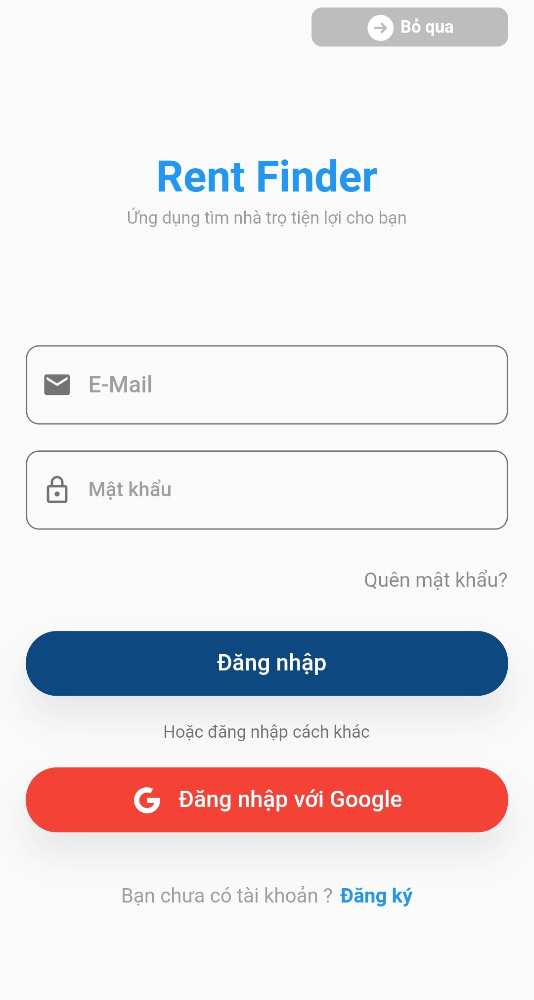 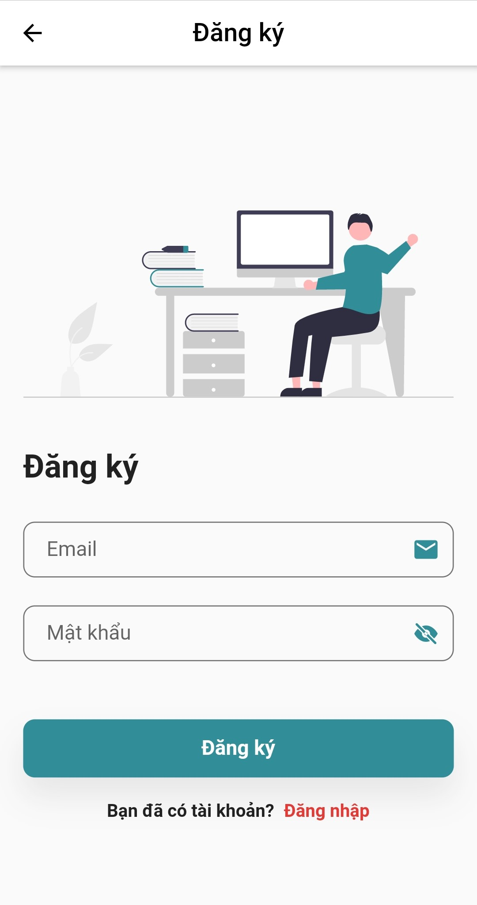 

### Xem nhà được cập nhật gần đây

  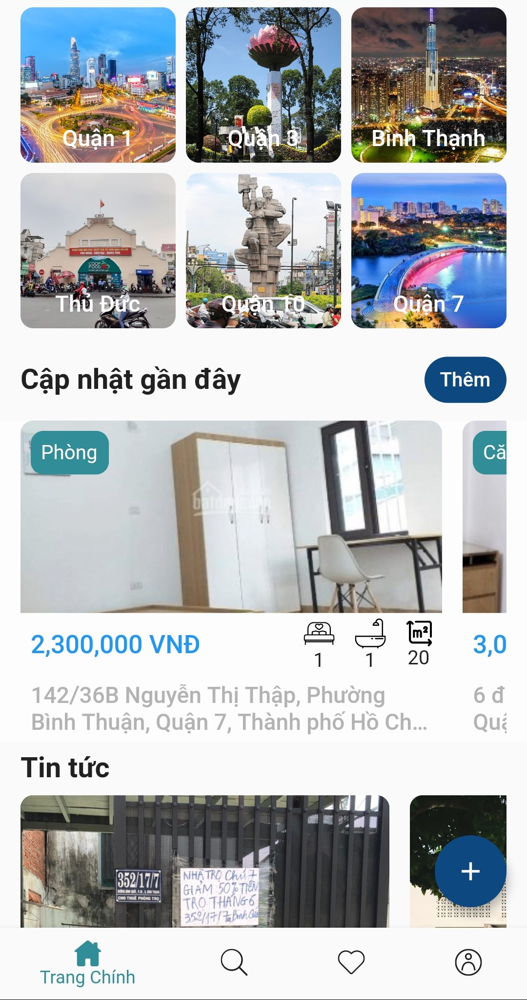

### Tìm kiếm nhà

  

### Quản lý danh sách nhà đã lưu

  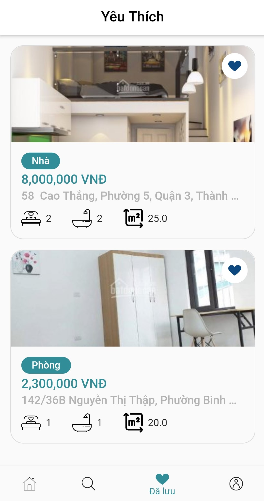

### Quản lý danh sách nhà đã xem

  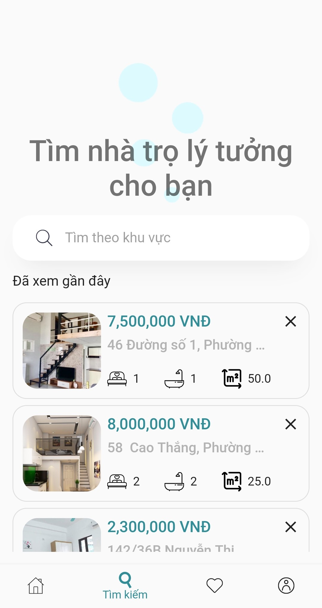

### Đăng tin cho thuê nhà

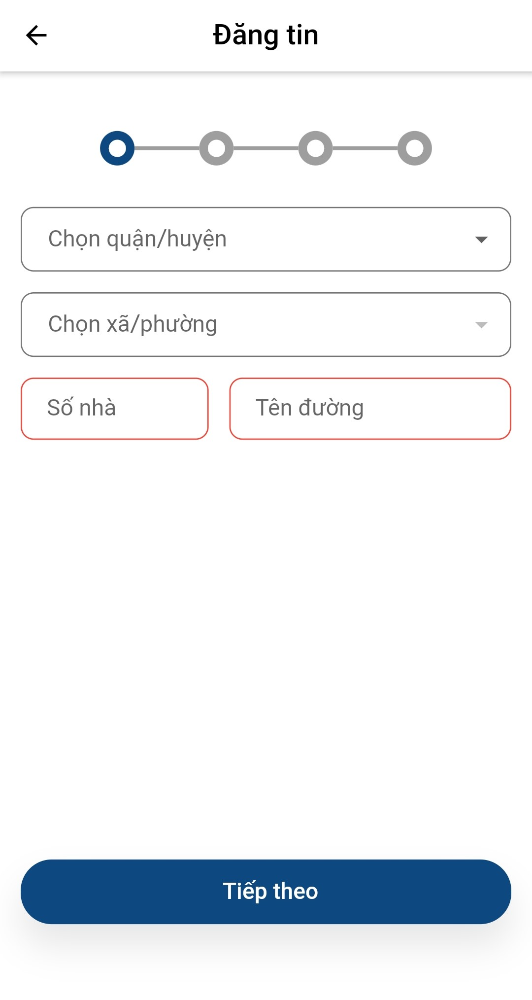 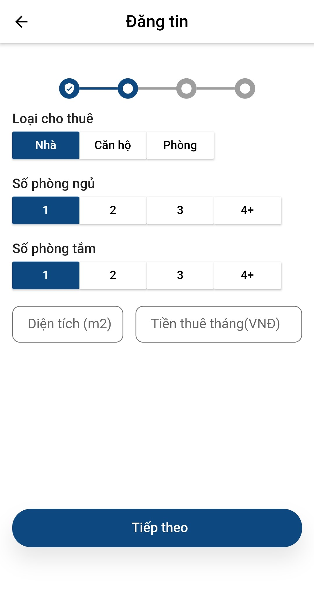
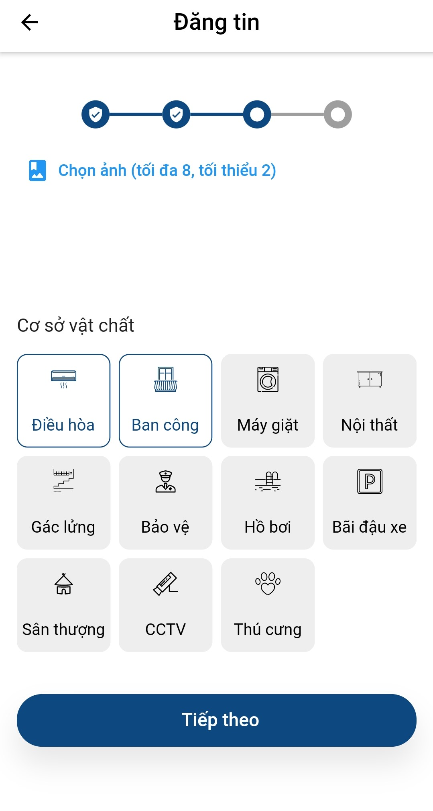 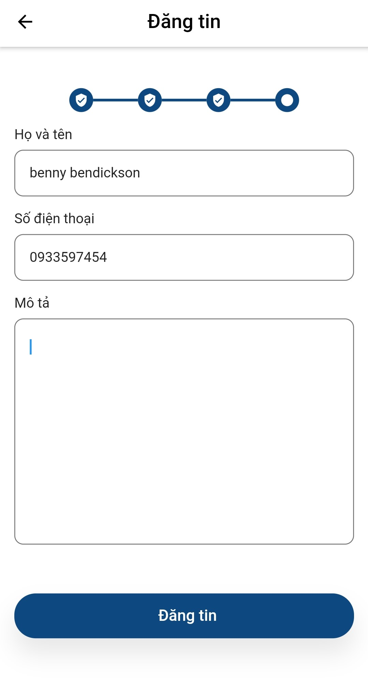

### Quản lý danh sách nhà đã đăng

  

### Báo cáo lỗi ứng dụng/Báo cáo vi phạm

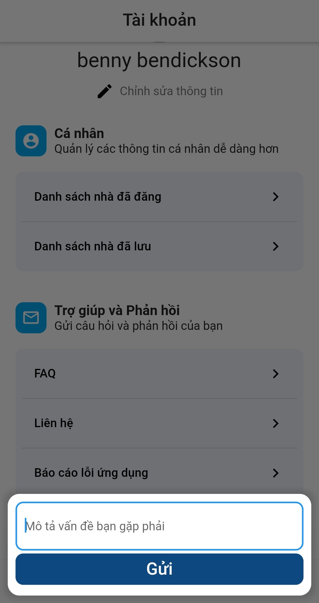 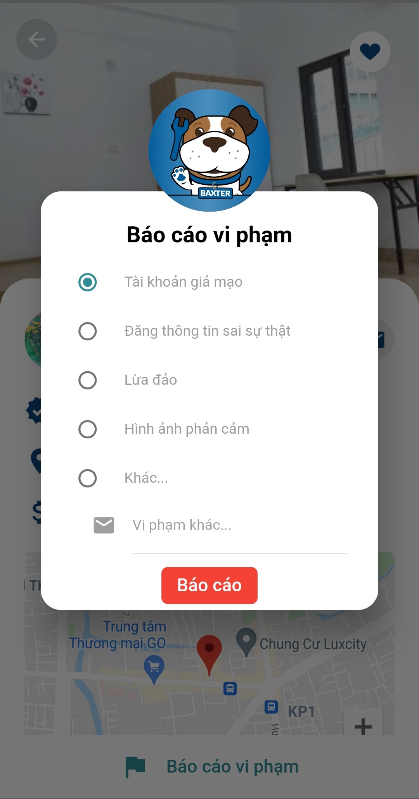

## Yêu cầu thiết bị

- Android:
  - Minimum SDK version: 20
  - Target SDK version: 30
- iOS: version 8.0

## Thư viện và công nghệ

- Ngôn ngữ: [Dart](https://github.com/dart-lang/sdk)
- Framework: [Flutter](https://github.com/flutter/flutter.git), version 2.0.3
- Database: Firebase Firestore
- Lưu trữ: Firebase Storage
- Quản lý người dùng: Firebase Authentication
- [BLoC](https://github.com/felangel/bloc.git)
- Google Maps Platform
- Mailgun
- [Google Sign In](https://github.com/flutter/plugins/tree/master/packages/google_sign_in)
- và nhiều thư viện khác

## Tác giả

- Đỗ Phi Long - 19521777@gm.uit.edu.vn
- Nguyễn Cao Cường - 19521298@gm.uit.edu.vn
- Đinh Việt Hào - 19521475@gm.uit.edu.vn

## Giấy phép

    Copyright 2021

    Licensed under the Apache License, Version 2.0 (the "License");
    you may not use this file except in compliance with the License.
    You may obtain a copy of the License at

        http://www.apache.org/licenses/LICENSE-2.0

    Unless required by applicable law or agreed to in writing, software
    distributed under the License is distributed on an "AS IS" BASIS,
    WITHOUT WARRANTIES OR CONDITIONS OF ANY KIND, either express or implied.
    See the License for the specific language governing permissions and
    limitations under the License.
